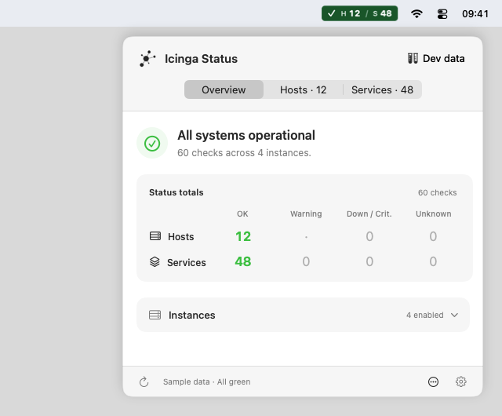
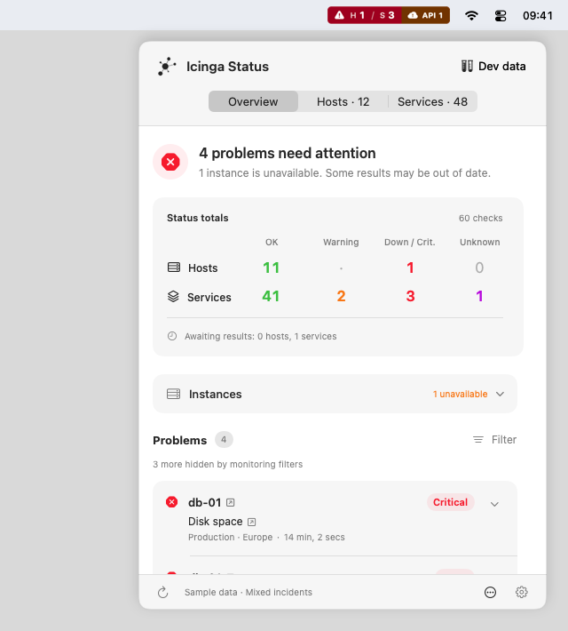
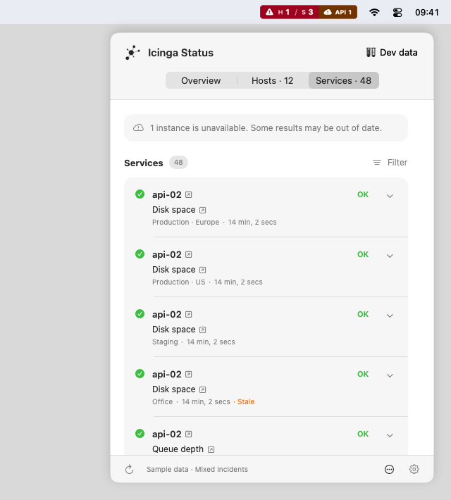
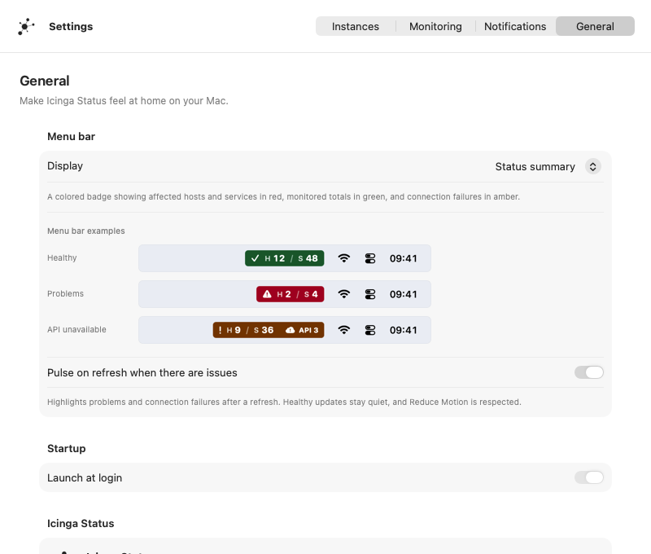

# Icinga Status for macOS

A native menu bar app for monitoring multiple Icinga 2 instances, built with Swift 6 and SwiftUI. Requires macOS 15 or later.

- Four menu bar styles with host and service totals, problem counts, and connection status.
- Overview, Hosts, and Services views with search, instance filters, and Icinga Web links.
- Support for Icinga Web 2 Monitoring and Icinga DB Web.
- Optional notifications, acknowledgements, and rechecks.
- Keychain credentials and per-instance certificate trust for private CAs.
- In-app updates powered by Sparkle, with optional automatic checks.

Icinga Status is an independent community project, unaffiliated with or endorsed by Icinga. It is provided as is, without warranties or guarantees of accuracy, availability, or support.

## Download

Check [GitHub Releases](https://github.com/bashgeek/icinga-status-macos/releases) for a signed macOS version. Download the app from an available release, unpack it, and move **Icinga Status.app** to **Applications** before launching. The app lives in the menu bar and has no Dock icon.

Choose **Check for Updates…** from the menu bar's More options menu or **Settings → General → Updates**. Automatic checks are opt-in, and you choose when to install an update. Versions without Sparkle, including v0.2.0, need one manual upgrade to a version with the updater. Development builds never update themselves.

## Screenshots

The examples below use development sample data, including simulated incidents and API failures.

| Healthy monitoring | Problems and API failures |
| --- | --- |
|  |  |

| Service inventory | Menu bar settings |
| --- | --- |
|  |  |

## Connect

Add an instance in Settings using its Icinga 2 HTTPS API URL, usually `https://icinga.example.com:5665`, and an API account with `objects/query/Host` and `objects/query/Service` permissions. A trailing `/v1` is accepted. This app supports the Icinga 2 API only.

Set the separate Icinga Web URL to enable host and service links. Choose Icinga DB Web explicitly if your URL does not identify the module. For acknowledgements and rechecks, enable actions per instance and grant `actions/acknowledge-problem` and `actions/reschedule-check` permissions.

## Build

Open `IcingaStatus.xcodeproj` in Xcode 26 or later. Copy `Config/Signing.local.xcconfig.example` to `Config/Signing.local.xcconfig` and set your Apple Development team. Keep the same signing identity across builds to preserve Keychain authorization.

```sh
./scripts/build.sh --run       # Build and launch
./scripts/build.sh --demo      # Debug only, isolated sample data and scenario switcher
swift test                    # Core tests
./scripts/test-tls.sh          # Local HTTPS integration tests
```

Build output is ignored under `build/`. Regenerate the Xcode project with `xcodegen generate` after changing `project.yml` or adding source files.

For distribution outside the App Store, copy `Config/Release.local.sh.example` to `Config/Release.local.sh` and fill in your Developer ID signing details. Local signing files are ignored by Git. Sparkle's private update-signing key stays in Keychain under account `net.blendbyte.icingastatus`; only its public verification key is in `Config/Info.plist`.

After committing the new version and increasing build number, push its matching `vX.Y.Z` tag and run `./scripts/release.sh --publish`. This builds, signs, notarizes, and publishes the ZIP, checksum, and signed `appcast.xml` together. GitHub Releases hosts both downloads and the update feed, so no separate server or GitHub signing workflow is needed. The repository must be public for users to download updates. Use `--notarize` to prepare these files without publishing, or `--help` for other options.

After building Debug, run `python3 scripts/capture-screenshots.py` to export the complete sample-data gallery to ignored `build/screenshots/`. The four images above are kept in `docs/screenshots/` for GitHub. To regenerate the menu bar examples bundled in Settings, run `python3 scripts/capture-menubar-examples.py` and rebuild.

## Credits

Inspired by [Icinga Multi Status](https://github.com/bashgeek/icinga-multi-status). The app icon comes from that project's `img/icon_black_*.png` assets at commit `4fe0bdca6df49db80cb571d65f1cdfa0f592b674`; the 1024-pixel variant is scaled from its 512-pixel original. Its [MIT license](Sources/IcingaStatus/Resources/IcingaMultiStatus-LICENSE.txt) is included in the app.

Updates use [Sparkle](https://sparkle-project.org/), with its [license and third-party notices](Sources/IcingaStatus/Resources/Sparkle-LICENSE.txt) included in the app.
